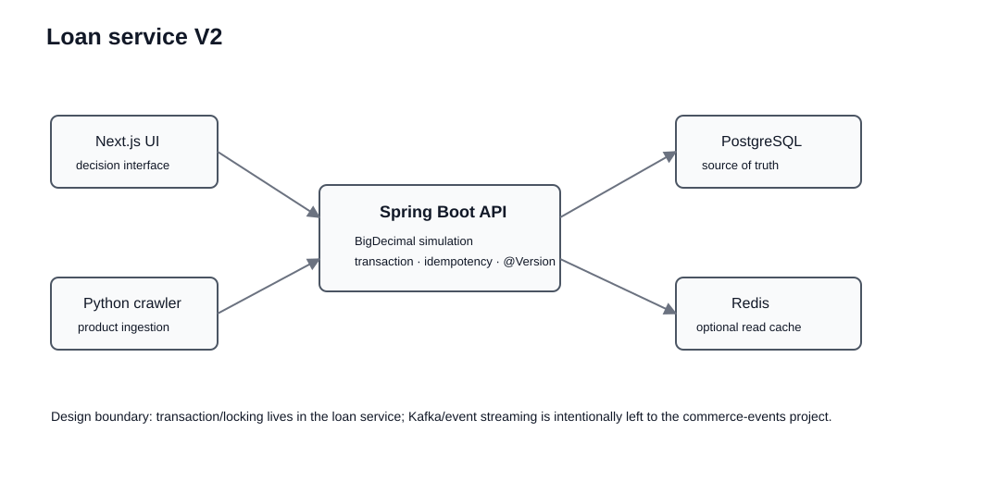

<div align="center">

# Loan Refinance Service

### Financial Calculation · Transaction · Optimistic Lock · Idempotency · Cache

대환대출 의사결정에서 필요한 총비용 계산을 출발점으로, **정확한 금융 연산과 데이터 정합성, 동시성 제어를 함께 다루는 Java/Spring 백엔드 프로젝트**로 확장했습니다.


**Existing web demo** · https://pay-off-loan.vercel.app/

</div>

---

## Executive Summary

처음 문제는 단순했습니다.

```text
현재 대출 금리 > 신규 대출 금리
→ 대환이 이득인가?
```

하지만 실제 의사결정은 금리 하나로 끝나지 않습니다.

```text
현재 원금
+ 남은 이자
+ 중도상환수수료
+ 인지세 / 이전비용
+ 상환 방식
+ 남은 기간
= 실제 총비용
```

기존 프로젝트는 Next.js와 TypeScript/Big.js로 이 비용을 계산하고 Python crawler로 금융상품 데이터를 수집하는 서비스였습니다.

V2에서는 이 도메인을 **Spring Boot backend로 재구성**하면서 문제를 한 단계 확장했습니다.

```text
계산 결과가 정확한가?
        ↓
동시에 같은 금융상품을 수정하면 어떤 값이 남는가?
        ↓
crawler가 timeout 후 같은 요청을 재전송하면 중복 적재되지 않는가?
        ↓
조회가 많아졌을 때 cache를 어디에 두어야 하는가?
        ↓
DB transaction과 외부 I/O의 경계는 어디여야 하는가?
```

따라서 이 프로젝트의 핵심은 단순 금융 계산보다 다음 네 가지입니다.

1. **Precision** — 금융 계산에 floating-point 오차를 허용하지 않기
2. **Consistency** — concurrent update에서 lost update 막기
3. **Retry Safety** — 같은 적재 요청이 재시도되어도 최종 상태를 한 번만 만들기
4. **Performance Boundary** — read-heavy endpoint에서 cache를 적용하되 consistency 비용도 함께 보기

---

## 1. System Evolution

### Phase 1. Decision Calculator

```text
Next.js UI
   ↓
TypeScript Simulation Service
   ↓
Big.js Decimal Arithmetic
   ↓
Supabase / PostgreSQL
```

초기 버전에서는 사용자가 입력한 대출 조건을 기준으로 다음 전략을 비교했습니다.

```text
KEEP_CURRENT
REFINANCE_NOW
WAIT_FOR_FEE_FREE_POINT
```

그리고 Python/Selenium crawler를 Web Runtime과 분리했습니다.

```text
External Product Source
        ↓
Python Crawling
        ↓
Cleansing
        ↓
Database
        ↓
Web Application
```

### Phase 2. Backend Consistency Service

기능을 더 만드는 대신 금융 서비스에서 더 중요한 문제를 다루기 위해 Spring Boot backend를 추가했습니다.



```text
Existing Next.js UI              Python Crawler
        │                             │
        └──────────┐       ┌──────────┘
                   ▼       ▼
                 Spring Boot
                      │
          ┌───────────┼────────────┐
          │           │            │
     Simulation    Product API   Cache
          │           │            │
          └────── PostgreSQL ─── Redis(optional)
```

현재 기존 UI와 crawler는 역사적 서비스 자산으로 보존되어 있으며, Spring backend는 **계산/상품관리의 source-of-truth 역할을 분리하기 위한 V2 service layer**입니다. 모든 legacy client가 Spring API로 완전히 전환되었다고 과장하지 않습니다.

---

## 2. Why BigDecimal?

금융 계산에서 `double`은 편하지만 decimal 값을 정확하게 표현하지 못할 수 있습니다.

```text
binary floating point
0.1 + 0.2 != exact 0.3 representation
```

금리, 월 상환액, 누적 이자, 수수료처럼 연산이 반복되는 도메인에서는 작은 오차라도 결과 신뢰성에 영향을 줄 수 있습니다.

### Alternatives

| Option | Advantage | Limitation |
|---|---|---|
| `double` | 빠르고 단순 | decimal 표현 오차 |
| 최소 화폐단위 `long` | 금액 연산 안정적 | 금리와 비율 연산 처리 복잡 |
| `BigDecimal` | decimal precision 명시 가능 | 연산/rounding 정책을 직접 관리해야 함 |

### Decision

Spring backend에서는 금액과 금리를 `BigDecimal`로 처리합니다.

```text
principal
   + interest
   + early repayment fee
   + migration cost
   ↓
refinance total cost
```

여기서 중요한 것은 BigDecimal 자체가 아니라 **도메인에서 precision을 non-functional requirement로 정의했다는 점**입니다.

---

## 3. Repayment Strategy Design

상환 방식에 따라 월별 원금/이자 계산 정책이 달라집니다.

현재 backend는:

```text
RepaymentCalculator
       ▲
       │
 ┌─────┴────────────┐
 │                  │
Equal Payment   Equal Principal
```

형태로 계산 정책을 분리합니다.

`RefinanceSimulationService`는 어떤 계산식을 직접 구현하지 않고 `RepaymentType`에 맞는 calculator를 선택합니다.

이 구조를 선택한 이유는 새로운 상환 방식이 추가될 때 다음을 피하기 위해서입니다.

```java
if (type == A) { ... }
else if (type == B) { ... }
else if (type == C) { ... }
```

즉 **orchestration과 계산 정책의 변경 이유를 분리**했습니다.

---

## 4. API Contract

### 4.1 Refinance Simulation

```http
POST /api/v1/simulations
```

개념적 요청:

```json
{
  "principal": 100000000,
  "currentAnnualRate": 0.055,
  "newAnnualRate": 0.042,
  "remainingMonths": 36,
  "earlyRepaymentFee": 700000,
  "migrationCost": 150000,
  "repaymentType": "EQUAL_PAYMENT"
}
```

결과:

```text
current total cost
refinance total cost
savings
recommendation
```

추천은 감성적인 문구가 아니라 `savings > 0`이라는 계산 결과에서 결정됩니다.

---

### 4.2 Product Query

```http
GET /api/v1/products
```

상품 목록은 `@Cacheable("loan-product-list")` 대상입니다.

쓰기 작업이 발생하면:

```text
product update/import
      ↓
@CacheEvict(allEntries = true)
      ↓
next read repopulates cache
```

방식으로 stale read를 줄입니다.

---

### 4.3 Idempotent Product Import

```http
POST /api/v1/products/imports
Idempotency-Key: crawl-2026-09-10-woori-001
```

재시도 상황:

```text
Crawler
  ↓ request
Server processes successfully
  ↓
Network timeout before response arrives
  ↓
Crawler cannot know whether write succeeded
  ↓
Retry same request
```

Idempotency가 없다면 같은 side effect가 두 번 실행될 수 있습니다.

현재 구조:

```text
Idempotency-Key
      ↓
idempotency_records lookup
      ↓
exists? ─ yes ─▶ existing resource response
   │
   no
   ↓
product save
   ↓
idempotency record save
```

추가로 `(bank_name, product_name)` unique constraint를 DB 최종 무결성 경계로 둡니다.

### Why both Idempotency and UNIQUE?

둘은 같은 문제를 완전히 동일하게 해결하지 않습니다.

```text
Idempotency Key
→ 같은 logical request의 retry를 식별

UNIQUE constraint
→ 서로 다른 request라도 동일 business entity 중복을 최종 차단
```

---

## 5. Concurrent Update: Lost Update Problem

상품 금리는 여러 관리자/수집 작업이 수정할 수 있습니다.

버전 검증이 없다면 다음 문제가 가능합니다.

```text
DB rate = 4.0%

Request A reads 4.0
Request B reads 4.0

A writes 4.2
B writes 4.1

Final = 4.1
A update disappears
```

이를 **lost update**로 봅니다.

### Solution: Optimistic Lock

`LoanProduct`에 JPA `@Version`을 사용합니다.

```text
id
bank_name
product_name
base_rate
version
```

Client는 수정 시 자신이 읽었던 `expectedVersion`을 전달합니다.

```http
PATCH /api/v1/products/{id}/rate
```

```json
{
  "value": 0.041,
  "expectedVersion": 3
}
```

서버의 현재 version이 이미 4라면 해당 요청은 stale request입니다.

```text
expected = 3
actual   = 4
   ↓
OptimisticLockException
   ↓
HTTP 409 Conflict
```

### Why Optimistic instead of Pessimistic Lock?

상품 금리 업데이트는 읽기 대비 쓰기 빈도가 상대적으로 낮을 것으로 가정합니다.

```text
Low conflict probability
→ wait-free read/update attempt
→ conflict 발생 시 retry/reload
```

충돌이 매우 빈번하고 순차 실행 자체가 중요하다면 pessimistic locking을 다시 검토할 수 있습니다.

즉 lock 종류는 취향이 아니라 **충돌 빈도와 실패 비용**으로 선택합니다.

---

## 6. Transaction Boundary

상품 import는 다음 상태를 함께 다룹니다.

```text
loan_products
+
idempotency_records
```

둘 중 하나만 저장되고 다른 하나가 실패하면 재시도 의미가 달라질 수 있습니다.

따라서 local DB write는 `@Transactional` boundary 안에서 처리합니다.

반면 crawler의 외부 network 요청 전체를 DB transaction에 넣지 않습니다.

```text
Bad
BEGIN
  external crawling
  external HTTP waiting
  DB write
COMMIT
```

이 구조는 DB connection과 transaction을 외부 I/O 시간만큼 오래 유지할 수 있습니다.

권장 경계:

```text
external I/O
    ↓
validate / transform
    ↓
short DB transaction
```

---

## 7. Cache: Performance vs Consistency

상품 목록은 read-heavy 후보이므로 Spring Cache를 적용했습니다.

현재 default 환경은 단순 cache로 실행할 수 있고, Redis profile에서는 shared Redis cache를 사용할 수 있습니다.

```text
Single Instance
→ in-process cache is cheap

Multiple Instances
→ local cache state diverges
→ shared cache candidate: Redis
```

### Why Redis is not automatically faster

Redis는 network hop이 존재합니다.

따라서:

```text
in-memory cache latency < Redis latency
```

일 수도 있습니다.

Redis를 도입하는 핵심 이유는 단순 속도가 아니라 **여러 application instance가 cache state를 공유해야 하는 요구**입니다.

실험에서는:

- p50 / p95 latency
- DB query count
- cache warm-up
- cache invalidation

을 함께 비교하도록 `experiments/cache_probe.py`를 제공합니다.

---

## 8. Experiment Design

상세 실험 계획: [`docs/EXPERIMENT_PLAN.md`](docs/EXPERIMENT_PLAN.md)

### E1. Optimistic Lock

질문:

> 같은 version으로 동시에 수정하면 몇 요청이 성공하고 몇 요청이 409가 되는가?

측정:

```text
HTTP 200 count
HTTP 409 count
final version
final base rate
```

실험 harness:

```bash
python experiments/optimistic_lock_probe.py --product-id 1 --version 0
```

### E2. Cache Boundary

질문:

> 상품 목록 반복 조회에서 local cache와 Redis shared cache는 어떤 비용 차이가 있는가?

측정:

```text
p50
p95
DB query count
cache hit behavior
```

### E3. Idempotent Retry

질문:

> 동일 Idempotency-Key 요청을 반복하면 DB state가 하나만 생성되는가?

검증:

```text
same request key
→ same resource
→ no duplicate product
```

성능 수치는 실제 실행 전에는 README 성과로 작성하지 않습니다.

---

## 9. Database Integrity

애플리케이션 validation만으로 데이터 무결성을 보장하지 않습니다.

DB는 마지막 방어선입니다.

```text
Application Validation
       ↓
Transaction Rule
       ↓
JPA Version
       ↓
UNIQUE / CHECK Constraint
       ↓
PostgreSQL
```

Flyway를 사용해 schema evolution을 코드와 함께 관리합니다.

이렇게 하면 개발자 로컬 DB와 배포 DB가 서로 다른 schema 상태가 되는 위험을 줄일 수 있습니다.

---

## 10. Test Strategy

Backend test는 계산 결과를 중심으로 구성합니다.

현재 주요 테스트:

```text
EqualPrincipalCalculatorTest
→ 원금균등 계산 검증

RefinanceSimulationServiceTest
→ current vs refinance total cost
→ savings / recommendation 검증
```

CI는 GitHub Actions + Java 17에서 다음 명령을 실행합니다.

```bash
cd backend
mvn -B verify
```

Spring backend 코드는 README와 별개로 Maven build/test 경로를 통해 검증할 수 있게 구성했습니다.

---

## 11. Existing Data Pipeline

기존 Python crawler는 그대로 보존합니다.

```text
crawling/
├── bank_crawlers/
├── crawler.py
├── cleansing.py
├── supabase_client.py
└── main.py
```

Crawler와 Web Request를 분리한 이유:

```text
Web request
→ 짧고 예측 가능한 latency 필요

Crawler
→ 외부 페이지 지연 / 실패 / retry 가능
```

실행 특성이 다른 작업을 같은 request path에서 처리하지 않습니다.

향후 crawler의 저장 endpoint를 Spring import API로 통합하면 idempotency boundary를 실제 ingestion flow와 연결할 수 있습니다.

---

## 12. Project Structure

```text
.
├── backend/
│   ├── pom.xml
│   ├── Dockerfile
│   └── src/
│       ├── main/java/dev/kangwoul/loanservice/
│       │   ├── simulation/
│       │   ├── product/
│       │   └── common/
│       ├── main/resources/
│       └── test/java/
│
├── src/                       # existing Next.js application
├── crawling/                  # existing Python product pipeline
├── experiments/
│   ├── optimistic_lock_probe.py
│   └── cache_probe.py
├── docs/
│   ├── ARCHITECTURE_DECISIONS.md
│   ├── INTERVIEW_GUIDE.md
│   ├── EXPERIMENT_PLAN.md
│   └── assets/
├── database_schema.sql
└── README.md
```

---

## 13. Tech Stack by Responsibility

| Responsibility | Technology | Why |
|---|---|---|
| Financial backend | Java 17 / Spring Boot | enterprise backend, transaction boundary |
| Decimal calculation | BigDecimal | financial precision |
| Persistence | PostgreSQL / JPA | relational consistency |
| Migration | Flyway | schema version management |
| Concurrency | JPA `@Version` | optimistic lost-update protection |
| Retry safety | Idempotency record + UNIQUE | duplicate side-effect protection |
| Cache | Spring Cache / Redis profile | read optimization / shared cache experiment |
| Existing UI | Next.js / TypeScript | decision interface |
| Existing data ingestion | Python / Selenium | external product collection |
| Verification | JUnit / Maven / GitHub Actions | reproducible backend verification |

---

## 14. Run Backend

### PostgreSQL

환경변수는 `backend/src/main/resources/application.yml` 기준으로 설정합니다.

```bash
cd backend
mvn spring-boot:run
```

Test:

```bash
mvn test
```

Full verification:

```bash
mvn verify
```

Redis profile을 사용할 경우:

```bash
mvn spring-boot:run -Dspring-boot.run.profiles=redis
```

---

## 15. Known Limitations

현재 상태를 production system처럼 과장하지 않습니다.

1. 기존 Next.js client가 모든 endpoint를 Spring backend로 완전히 이전한 상태는 아닙니다.
2. 동시 idempotency-key insert 경쟁은 DB unique exception handling을 더 명시적으로 다듬을 수 있습니다.
3. cache benchmark 결과는 환경별로 직접 측정해야 합니다.
4. crawler scheduling/retry는 별도 Queue/Worker로 아직 분리하지 않았습니다.
5. 금융 정책은 실제 은행별 복잡한 fee rule 전체를 포함하는 commercial engine이 아닙니다.
6. 인증/인가와 관리자 권한 모델은 현재 포트폴리오 범위 밖입니다.

이 limitation은 기술을 더 넣기 위한 목록이 아니라 **다음 문제의 우선순위를 판단하기 위한 목록**입니다.

---

## 16. Why Kafka Is Not in This Project

이 프로젝트에도 Kafka를 넣을 수는 있습니다. 하지만 현재 핵심 문제는:

```text
financial precision
transaction
concurrent row update
idempotent write
cache consistency
```

입니다.

메시지 replay와 여러 consumer가 필요한 실제 요구가 없는 상태에서 Kafka를 추가하면 기술이 문제보다 앞서게 됩니다.

Event streaming은 별도 `Commerce Event Pipeline` 프로젝트에서 집중적으로 다룹니다.

---

## 17. Interview Story

### 30-second version

> 대환대출 서비스를 만들면서 처음에는 금리와 수수료를 정확히 계산하는 문제에 집중했습니다. 그래서 TypeScript에서는 Big.js를 사용했고, 이후 Java/Spring backend로 확장하면서 금융 계산을 BigDecimal로 옮겼습니다. 상품 데이터가 여러 경로에서 갱신될 수 있다고 보고 JPA @Version으로 lost update를 막고 stale request를 409로 반환했습니다. crawler의 timeout retry가 중복 적재를 만들 수 있어 Idempotency-Key와 DB unique constraint를 함께 사용했습니다. 조회 endpoint는 cache 후보로 분리했지만 Redis가 무조건 빠르다고 가정하지 않고 local cache와 shared cache의 비용을 p95와 DB query count로 비교하도록 실험 harness를 만들었습니다.

### Questions this repository can defend

- 왜 금융 계산에 `double` 대신 `BigDecimal`을 사용하는가?
- Transaction 범위를 왜 external I/O까지 길게 잡으면 안 되는가?
- Optimistic Lock과 Pessimistic Lock의 선택 기준은 무엇인가?
- HTTP 409는 어떤 상황에서 반환하는가?
- Idempotency와 UNIQUE constraint는 어떤 차이가 있는가?
- Redis cache가 in-memory cache보다 항상 빠른가?
- Cache invalidation은 왜 어려운가?
- crawler를 web request에서 분리한 이유는 무엇인가?
- 왜 Kafka를 이 프로젝트에 넣지 않았는가?

상세 답변은 [`docs/INTERVIEW_GUIDE.md`](docs/INTERVIEW_GUIDE.md)에 정리되어 있습니다.

---

## 18. Development Direction

다음 순서의 개선을 우선합니다.

```text
1. Spring API와 existing UI integration
2. crawler → idempotent ingestion API 연결
3. simultaneous idempotency race integration test
4. Testcontainers PostgreSQL integration test
5. cache benchmark raw result 저장
6. authentication / authorization boundary
7. operational metrics
```

---

## Engineering Principle

> **금융 서비스에서는 빠른 코드보다 먼저 틀리지 않는 코드가 필요하고, 동시성이 생기면 최종 상태가 왜 그렇게 되었는지 설명할 수 있어야 한다.**

이 프로젝트는 Java/Spring 기술 목록을 보여주는 것이 아니라 **정확성 → 정합성 → retry safety → 성능이라는 우선순위로 백엔드 문제를 해결하는 과정**을 보여주는 것을 목표로 합니다.
